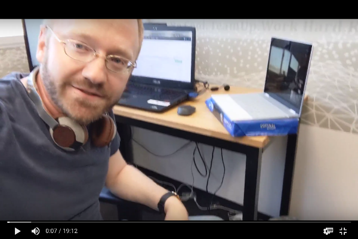
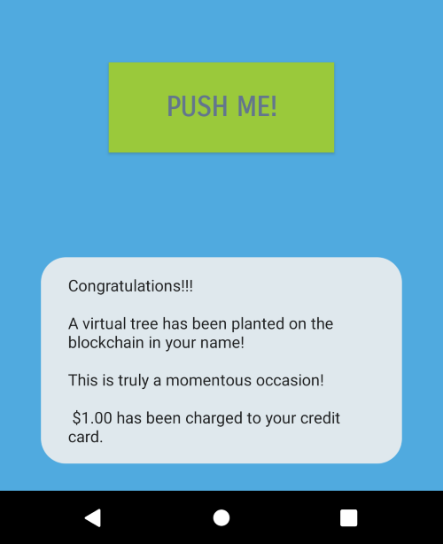

I couldn’t believe it.

My new app, “Virtree,” was doing amazingly well on the play store. It had been at the top of both “Product Hunt” and “Show HN” for weeks. In under one month since launch, people had downloaded it more than 100,000 times.

At six months with more than 500,000 installs, I was going to have to shut it down.

#### Hi, I’m Yitzi.

I build apps for a living. Mostly for large corporations that pay me an excellent take-home salary and then go on to make exponentially more than that from my hard work.

I’m good at what I do. I know that because the play store data is publicly available. I can see how much people love my apps by the number of times they download them, and by the reviews they leave (I read every one). It irritates me that my work is not published under my name but rather under the name of the corporation. They wouldn’t know an SDK from an APK!

It’s been my dream to support myself as an Indie Developer. I would be able to make the products I’ve always dreamed of ( I have a list with more than 100 ideas on it! ). Owning my creations would be the cherry on top ([ask Taylor Swift](https://twitter.com/taylorswift13/status/1195123215657508867)).

#### My plan.

I’m not naive. I know that building an amazing and beautiful app is not enough. I’m not happy about that, but I do need to take it into account.

It’s a chicken and egg problem. The best apps rank well and show up on the front page of the Appstore. To show up there, however, the app already needs to be getting some traction.

At companies where I’d worked, I noticed this:

Regardless of how useful and necessary, no manager authorized an app launch without an advertising budget and plan.

It works like this:

*   Advertising campaigns led to non-organic installs.
*   Installs make the app rank and become more visible.
*   Mobile users will discover the app on their own and download it.

By saving up and pitching friends and relatives, I was able to set up a decent sized advertising budget. I figured I had enough for six months. I knew that my app was good and filling a real need. I was sure it would be profitable by then.

#### The app.

I decided to begin my career as an indie developer with “Virtree.”

Virtree is an app that allows you to “plant” trees on Virtree’s proprietary blockchain. Currently, we only support binary trees with Red-Black trees coming soon.

My friends loved it!

The trees can be planted in memoriam of a loved one or as a special gift for a spouse or fiance.

Forest fires will never destroy these trees. Neither will Lyme disease threaten them. Visiting your tree is as easy as whipping out your phone.

From my friends’ reactions to the app, I knew I had a winner. I was sure that if I only got some eyes on it, the rest would take care of itself.

#### The launch.

Click. Click. Click.

It had been 24 hours since I had deployed my signed APK, and it was still in “Pending Publication” limbo.

I was refreshing the screen compulsively and not answering calls or doing much of anything for that matter. When the status finally changed to “Published,” it didn’t even register until I had refreshed the page at least another five times.

I called up all my friends and insisted they download my app with me on the line. I felt a chemical rush each time I saw the install count go up. This is the life I thought to myself. It’s this easy. Why didn’t I have the guts to try this earlier?

I began posting on Facebook groups and sharing on Twitter. Downloads and installs spiked. I started fantasizing about new Apple products and trips to Hawaii.

Then I hit 42 downloads. “Hit” is a very accurate description. It was as if I had hit something substantial. A wall or something. Nothing I did could budge the needle.

I had exhausted myself. A vacation was what I needed. I packed up my gear and headed for a week off the grid at Yellowstone.

When I got back home, I raced to my computer with my loaded backpack still on. 41. Yikes.

#### Ads. Ads. Ads.

I wasn’t that worried because I had been planning all along to do some advertising. It’s just that part of me wasn’t ready to admit that. I had a deep inner belief that advertising my app would be “cheating.” I wanted to make it on my own. Now, faced with the prospect of needing to ask for my job back, I was ready.

“kualitychepeinstalls.onion is fantastic,” said my friend Greg. Greg has made a ton of money investing in Bitcoin and considers himself qualified to dispense advice as frequently as a soda machine dispenses sugar.

Five dollars and thirty minutes later, I had 5,000 fresh installs. I couldn’t believe it! I went back to “kualitychepeinstalls.onion” and transferred another forty-five dollars. Sure enough, in under an hour, I had another 45,000 installs.

I began paying for Facebook and Google ads as well. “kualitychepeinstalls” was great, but the whole “.onion” thing was weirding me out. Plus, I figured three is better than one and could only serve to diversify my reach.

I needed more of this!

#### One month later.

!%$#@%@!!

I’ve got 100,000 installs. I have no idea if those installs are organic or if they came from Facebook, Google, or KualityChepe.

KualityChepe claims they are all from them, and I better transfer another fifty thousand, or else.

Even worse than that issue is this one:

Only three trees were purchased, two of them by the same user!

If this continues, I’d be finished.

#### Five months after that.

I’m finished.

#### A ray of hope.

Driving home from WeWork for the last time with all my stuff in the trunk, I was about to flip on some depressing Country when “Indie Hackers” starts playing. Funny because I don’t remember that I was listening to it on the way to work.

The host is interviewing some indie dev who “made it.” The developer (I can’t remember who it was) described a situation similar to mine and began talking about how mobile attribution completely turned around his ad spend and strategy. I was having the same problem as he was! Many installs but very few quality ones. I made a mental note to google “mobile attribution” when I got home.

#### A new lease.

I had high hopes for mobile attribution. From what I understood, this technology would help me prove how many clicks were coming from each network, so I would not get overcharged.

More importantly, it would allow me to take a scientific approach to my advertising. I would be able to understand where I was getting the most value and which networks I should drop.

#### A new plan.

I did a second fundraising round, and by psychologically pressuring and manipulating my friends and family, I was able to raise enough funds for two additional months of advertising. I also received promises of extra funding if I could prove that the advertising was working to increase bottom-line revenue.

Appsflyer seemed to be the platform of choice for three reasons:

*   They integrate with over 2,000 ad networks making it easier for me to get started quickly.
*   They own the market and therefore have a kind of “network effect” advantage. AppsFlyer can more accurately and frequently correctly identify and attribute a user.
*   I have a friend who works there, and she sent me links to their Github, where they have sample integrations, as well as to their “quick-start” guide.

So I planned to go through their Github and install guide and then integrate their SDK into my app. Once that was done, I would advertise my app in a wide variety of places. After a month, I would carefully analyze the data and become much smarter. I would understand my users, where they are coming from, and what are they doing inside my app.

I would then advertise for a second month based on the outcome of that analysis.

#### Conclusion.

Well, I don’t want to give it all away now. Suffice it to say that I’m still an indie developer, I always integrate Appsflyer into every software product I build, and Virtree never made me any money.

Thanks for reading!

Disclaimer: Very little of this is true, it belongs to the genre of “developer fiction”.
<!--stackedit_data:
eyJoaXN0b3J5IjpbLTE4MzY0NDY4MjNdfQ==
-->